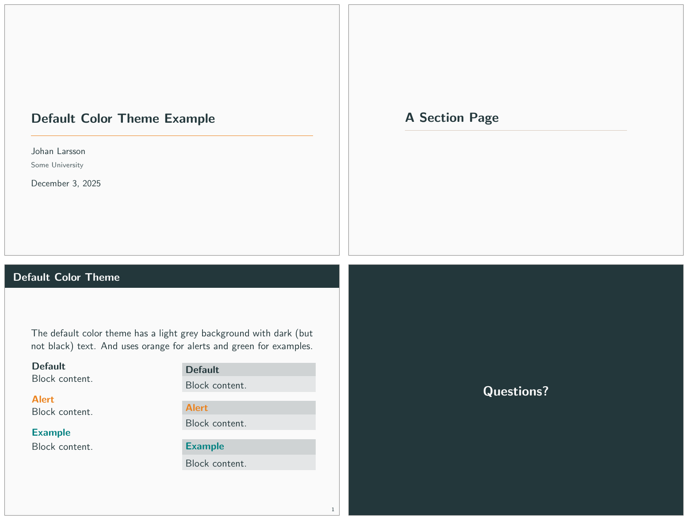
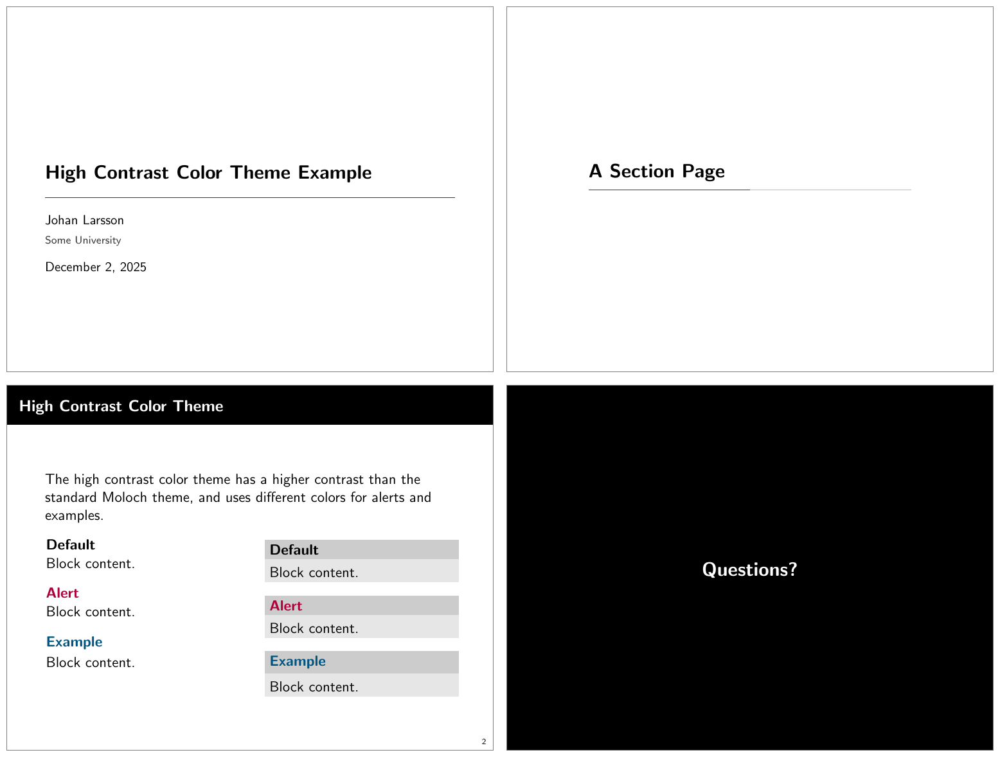
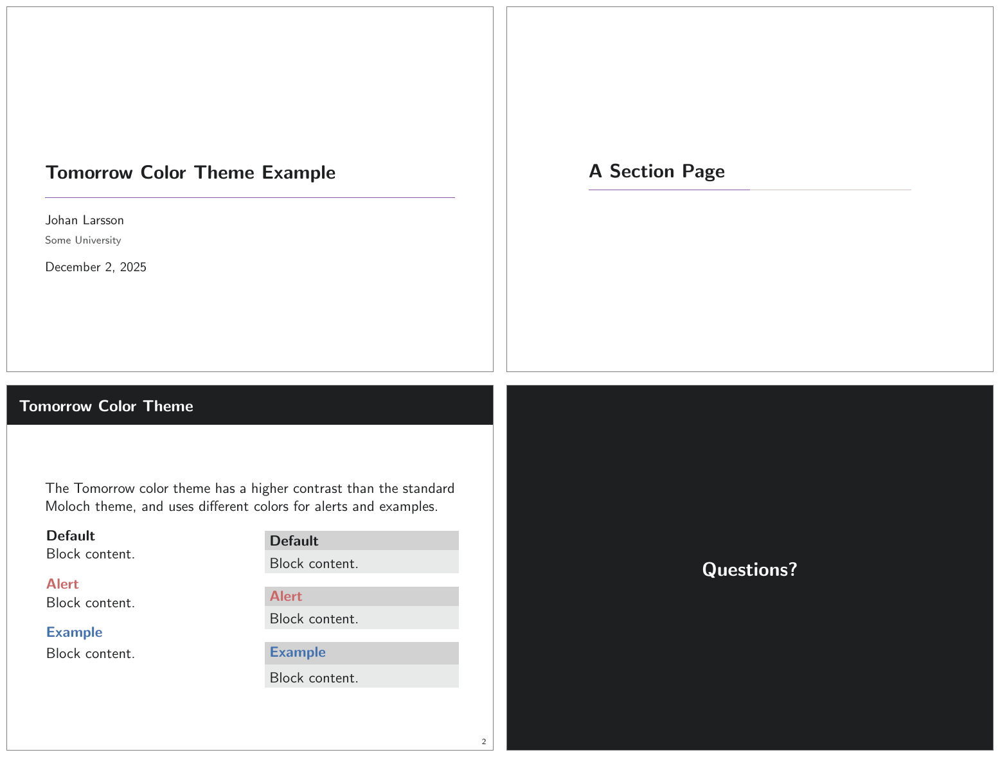

# Customization

The theme provides a number of options, which can be set using a key=value
interface. The primary way to set options is to provide a comma-separated list
of option-value pairs when loading Moloch in the preamble:

```latex
\usetheme[
    option1=value1,
    option2=value2,
    ...
]{moloch}
```

Options can be changed at any time---even mid-presentation---with the
`molochset()` macro.

```latex
\molochset{
    option1=newvalue1,
    option2=newvalue2,
    ...
}
```

The list of options is structured as shown in the following example.

::: {.describe-option option-name="<option-name>" values="<list>, <of>,
<values>" default="<default>"}

A short description of the option.

:::

## Main Theme

::: {.describe-option option-name="titleformat" values="regular, smallcaps,
allsmallcaps, allcaps" default="regular"}

Changes the format of titles, subtitles, section titles, frame titles, and the
text on "standout" frames. The available options produce Regular,
[SmallCaps]{.smallcaps}, [allsmallcaps]{.smallcaps}, or ALLCAPS titles. Note
that these commands do not affect math and numbers, so may not work as you
expect if your titles contain these.

:::

::: {.describe-option option-name="standoutnumberformat" values="regular,
smallcaps, allsmallcaps, allcaps" default="regular"}

Changes the format of "standout" frames (see `titleformat`, above).

:::

## Inner Theme

These options control the inner theme, which is responsible for elements like
section and subsection pages.

::: {.describe-option option-name="sectionpage" values="none, simple,
progressbar" default="progressbar"}

Adds a slide at the start of each section (`simple`) with an optional thin
progress bar below the section title (`progressbar`). The `none` option disables
the section page.

:::

```latex
\documentclass{beamer}
\usetheme{moloch}

\begin{document}

\molochset{sectionpage=progressbar} % the default

\section{Section One}

\molochset{sectionpage=simple}

\section{Section Two}

\molochset{sectionpage=none}

\section{Section Three} % Will not have a section page

\end{document}
```

{.lightbox}

::: {.describe-option option-name="subsectionpage" values="none, simple,
progressbar" default="none"}

Optionally adds a slide at the start of each subsection. If enabled with the
`simple` or `progressbar` options, the style of the `section page` will be
updated to match the style of the `subsection page`. Note that section slides
and subsection slides can appear consecutively if both are enabled; you may want
to use this option together with `sectionpage=none` depending on the section
structure of your presentation.

:::

::: {.describe-option option-name="standoutnumbering" values="none, hide, show"
default="none"}

This option decides whether or not to count standout pages as frames if frame
counting. Option `none` (the default) means that the standout frames are not
counted. `hide` means that they are counted but that there won't be any footer
showing a frame number. `show` means that they are counted and that the frame
number count is shown in the same fashion as for regular frames.

:::

## Outer Theme

These options control the outer theme, which is responsible for elements like
the frame numbering and progress bar.

::: {.describe-option option-name="numbering" values="none, counter, fraction"
default="(none specified)"}

_This option is deprecated and will be removed in a future version. Please use
Beamer's `page number in head/foot` template instead._ Controls whether the
frame number at the bottom right of each slide is omitted (`none`), shown
(`counter`) or displayed as a fraction of the total number of frames
(`fraction`).

:::

::: {.describe-option option-name="progressbar" values="none, head, frametitle,
foot" default="none"}

Optionally adds a progress bar to the top of each frame (`head`), the bottom of
each frame (`foot`), or directly below each frame title (`frametitle`).

:::

```latex
\documentclass{beamer}

\usetheme{moloch}

\begin{document}

\molochset{progressbar=none} % the default

\begin{frame}
  \frametitle{Progress Bar Example}

  The default is to have no progress bar.
\end{frame}

\molochset{progressbar=head}

\begin{frame}
  \frametitle{Progress Bar Example}

  The progress bar is now displayed at the top of the frame.
\end{frame}

\molochset{progressbar=foot}

\begin{frame}
  \frametitle{Progress Bar Example}

  The progress bar is now displayed at the bottom of the frame.
\end{frame}

\molochset{progressbar=frametitle}

\begin{frame}
  \frametitle{Progress Bar Example}

  The progress bar is now displayed in the frametitle area.
\end{frame}

\end{document}
```

{.lightbox}

## Color Theme

These options control color aspects of the theme, and are forwarded to the color
theme.

::: {.describe-option option-name="block" values="transparent, fill"
default="transparent"}

Optionally adds a light grey background to block environments like `theorem` and
`example`.

:::

```latex
\documentclass{beamer}
\usetheme{moloch}

\begin{document}

\begin{frame}
  \begin{block}{Default Block}
    This is a standard block.
  \end{block}

  \molochset{block=fill}

  \begin{block}{Filled Block}
    This is a filled block.
  \end{block}

\end{frame}
\end{document}
```

{.lightbox}

::: {.describe-option option-name="background" values="dark, light"
default="light"}

Provides the option to have a dark background and light foreground instead of
the reverse.

:::

```latex
\documentclass{beamer}

\usetheme[background=dark]{moloch}

\begin{document}

\begin{frame}
  \frametitle{Background Color}

  This slide uses the \texttt{background=dark} option, swaps the
  foreground and background colors defined by the moloch theme.
\end{frame}
\end{document}
```

{.lightbox}

## Font Theme

::: {.describe-option option-name="titleformat plain, titleformat frametitle,
titleformat section" values="regular, smallcaps, allsmallcaps, allcaps"
default="regular"}

Individually controls the format of titles, subtitles, section titles, and frame
titles (see `titleformat`, above).

:::

## Color Customization

The included Moloch color theme is used by default, but its colors can be easily
changed to suit your tastes. All of the theme's styles are defined in terms of
three beamer colors:

- `normal text` (dark fg, light bg)
- `alerted text` (colored fg, should be visible against dark or light)
- `example text` (colored fg, should be visible against dark or light)

An easy way to customize the theme is to redefine these colors using the
following syntax in your preabmle:

```latex
\setbeamercolor{ ... }{ fg= ... , bg= ... }
```

For additional customization, you can redefine any of the other stock beamer
colors. In addition to the stock colors the theme defines a number of Moloch
specific colors, which can also be redefined to your liking.

```latex
\setbeamercolor{progress bar}{ ... }
\setbeamercolor{title separator}{ ... }
\setbeamercolor{progress bar in head/foot}{ ... }
\setbeamercolor{progress bar in section page}{ ... }
```

## Themes

### Default Theme

The default color theme is almost exactly the same as in the original Metropolis
theme, except we have modified the green color for the example blocks to be a
bit less saturated.

```latex
\usecolortheme{moloch}
```

{.lightbox}

### The High Contrast Theme

For low-light situations Moloch it might be helpful to use the
`moloch-highcontrast` color theme. It is enabled like any other color theme:

```latex
\usecolortheme{moloch-highcontrast}
```

{.lightbox}

### The Tomorrow Theme

There is also a theme based on the
[https://github.com/chriskempson/tomorrow-theme](Tomorrow color theme), which
you can enable like this:

```latex
\usecolortheme{moloch-tomorrow}
```

{.lightbox}
