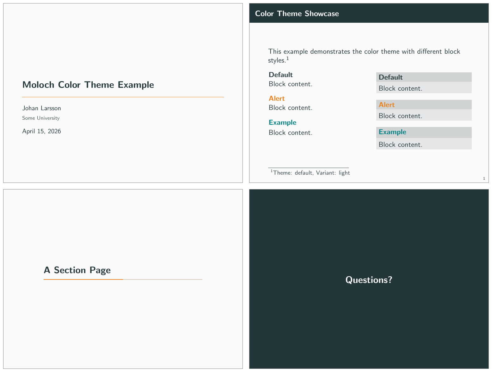
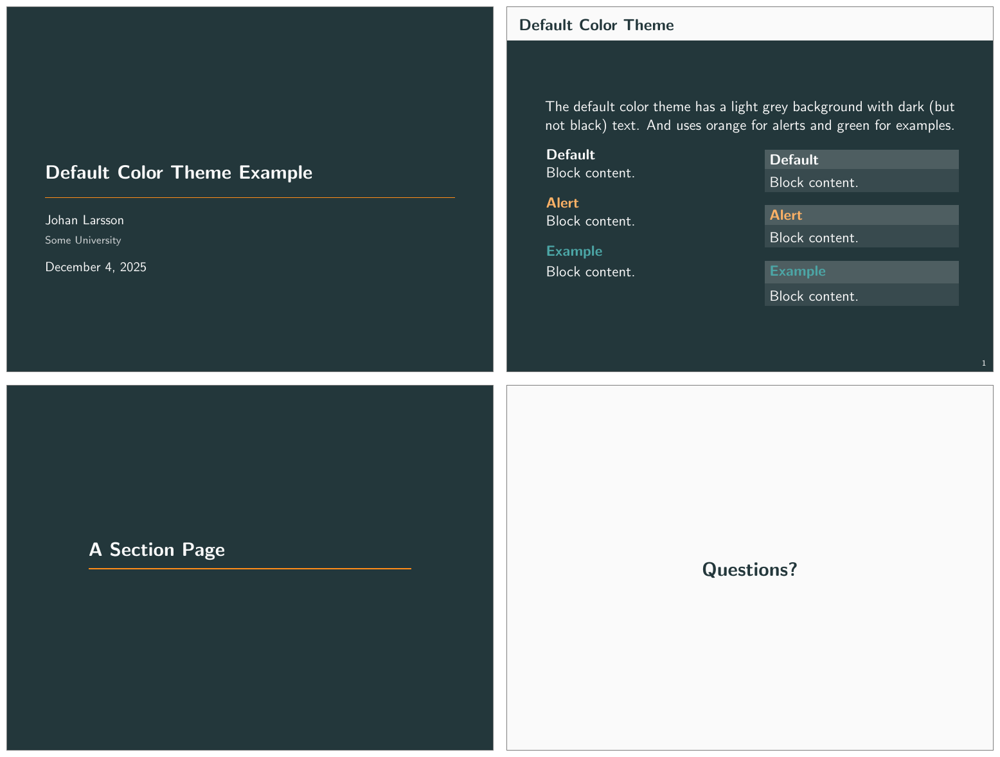
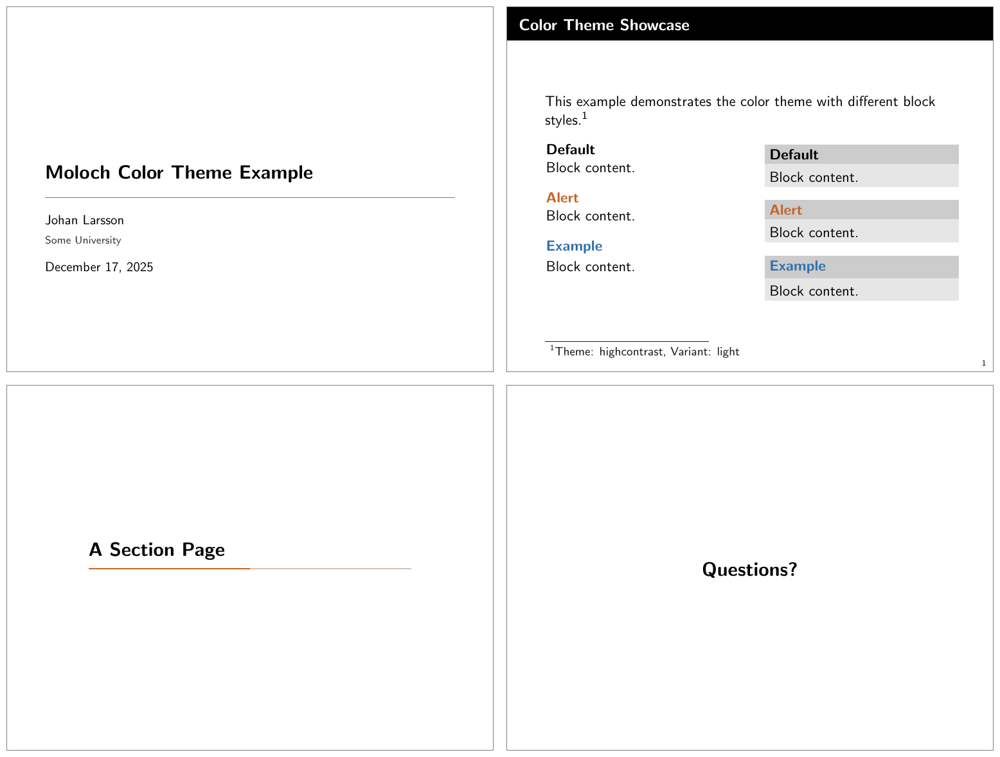
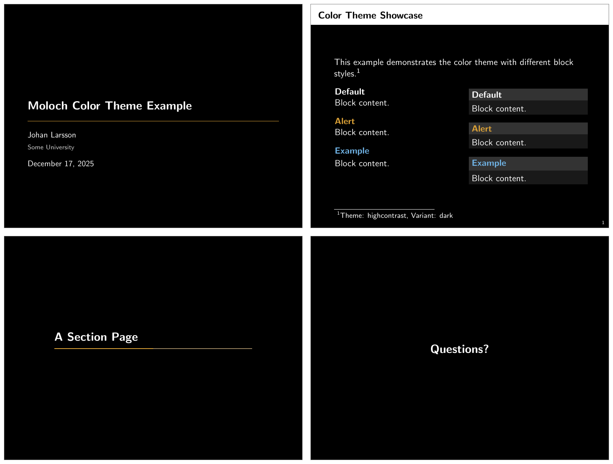
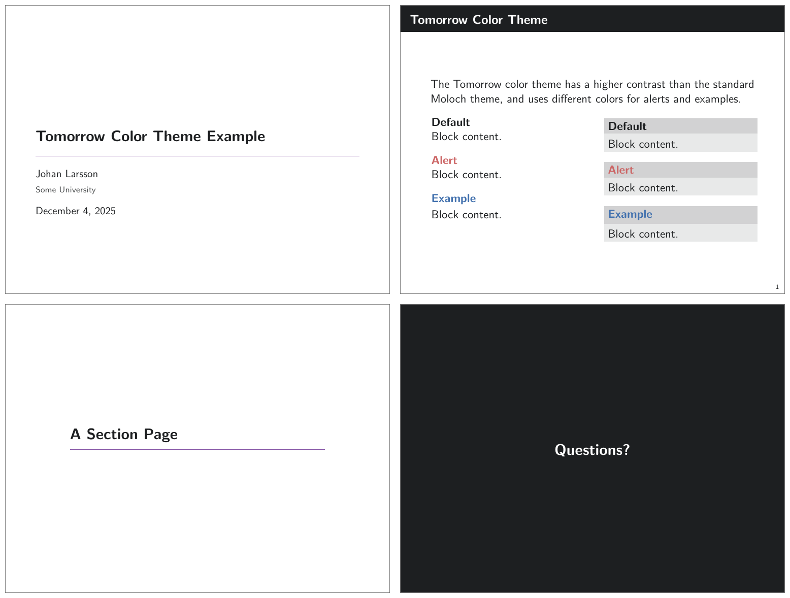
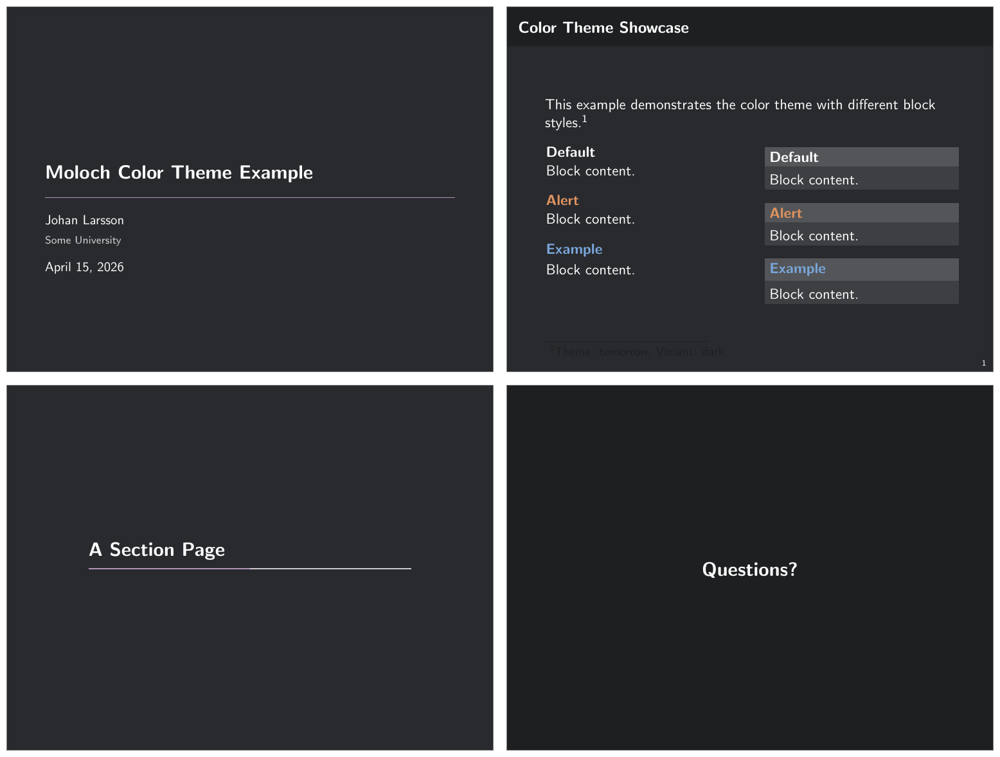
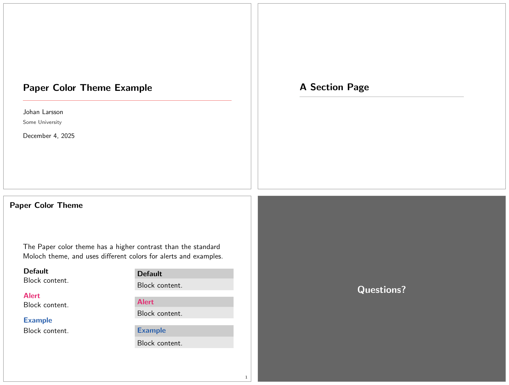
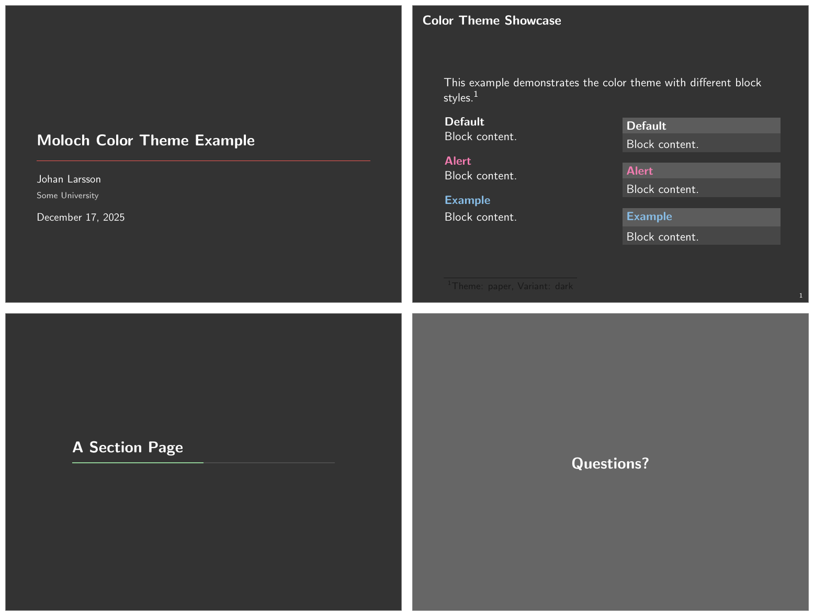
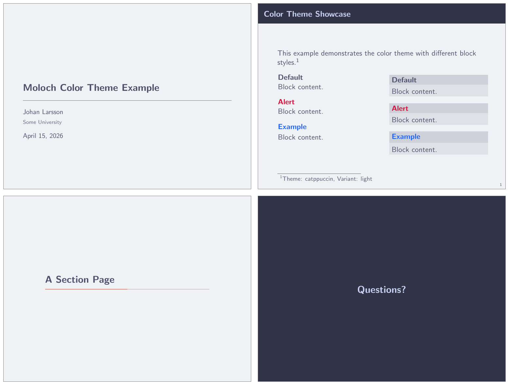
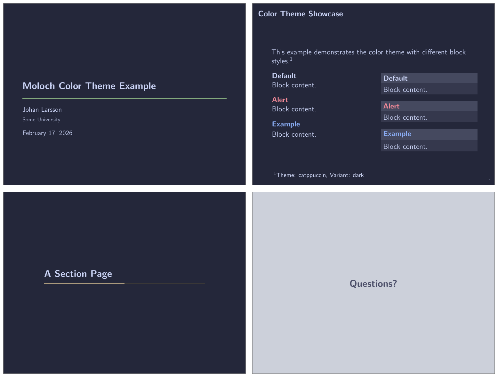

The theme provides a number of options, which can be set using a key=value
interface. The primary way to set options is to provide a comma-separated list
of option-value pairs when loading Moloch in the preamble:

```latex
\usetheme[
  option1=value1,
  option2=value2,
  ...
]{moloch}
```

Options can be changed at any time---even mid-presentation---with the
`molochset()` macro.

```latex
\molochset{
  option1=newvalue1,
  option2=newvalue2,
  ...
}
```

The list of options is structured as shown in the following example.

::: {.describe-option option-name="some option" values="default value, another
value, yet another value" default="default value"}

A short description of the option.

:::

## Main Theme

::: {.describe-option option-name="titleformat" values="regular, smallcaps,
allsmallcaps, allcaps" default="regular"}

Changes the format of titles, subtitles, section titles, frame titles, and the
text on "standout" frames. The available options produce Regular,
[SmallCaps]{.smallcaps}, [allsmallcaps]{.smallcaps}, or ALLCAPS titles. Note
that these commands do not affect math and numbers, so may not work as you
expect if your titles contain these.

:::

::: {.describe-option option-name="standoutnumberformat" values="regular,
smallcaps, allsmallcaps, allcaps" default="regular"}

Changes the format of "standout" frames (see `titleformat`, above).

:::

## Inner Theme

These options control the inner theme, which is responsible for elements like
section and subsection pages.

::: {.describe-option option-name="sectionpage" values="none, simple,
progressbar" default="progressbar"}

Adds a slide at the start of each section (`simple`) with an optional thin
progress bar below the section title (`progressbar`). The `none` option disables
the section page.

:::

```latex
\documentclass{beamer}
\usetheme{moloch}

\begin{document}

\molochset{sectionpage=progressbar} % the default

\section{Section One}

\molochset{sectionpage=simple}

\section{Section Two}

\molochset{sectionpage=none}

\section{Section Three} % Will not have a section page

\end{document}
```

{.lightbox}

::: {.describe-option option-name="subsectionpage" values="none, simple,
progressbar" default="none"}

Optionally adds a slide at the start of each subsection. If enabled with the
`simple` or `progressbar` options, the style of the `section page` will be
updated to match the style of the `subsection page`. Note that section slides
and subsection slides can appear consecutively if both are enabled; you may want
to use this option together with `sectionpage=none` depending on the section
structure of your presentation.

:::

::: {.describe-option option-name="standoutnumbering" values="none, hide, show"
default="none"}

This option decides whether or not to count standout pages as frames if frame
counting. Option `none` (the default) means that the standout frames are not
counted. `hide` means that they are counted but that there won't be any footer
showing a frame number. `show` means that they are counted and that the frame
number count is shown in the same fashion as for regular frames.

:::

## Outer Theme

These options control the outer theme, which is responsible for elements like
the frame numbering and progress bar.

::: {.describe-option option-name="numbering" values="none, counter, fraction"
default="(none specified)"}

::: {.callout-warning}

## Deprecated

This option is deprecated and will be removed in a future version. Please use
Beamer's `page number in head/foot` template instead.

:::

Controls whether the frame number at the bottom right of each slide is omitted
(`none`), shown (`counter`) or displayed as a fraction of the total number of
frames (`fraction`).

:::

::: {.describe-option option-name="progressbar" values="none, head, frametitle,
foot" default="none"}

Optionally adds a progress bar to the top of each frame (`head`), the bottom of
each frame (`foot`), or directly below each frame title (`frametitle`).

:::

```latex
\documentclass{beamer}

\usetheme{moloch}

\begin{document}

\molochset{progressbar=none} % the default

\begin{frame}
  \frametitle{Progress Bar Example}

  The default is to have no progress bar.
\end{frame}

\molochset{progressbar=head}

\begin{frame}
  \frametitle{Progress Bar Example}

  The progress bar is now displayed at the top of the frame.
\end{frame}

\molochset{progressbar=foot}

\begin{frame}
  \frametitle{Progress Bar Example}

  The progress bar is now displayed at the bottom of the frame.
\end{frame}

\molochset{progressbar=frametitle}

\begin{frame}
  \frametitle{Progress Bar Example}

  The progress bar is now displayed in the frametitle area.
\end{frame}

\end{document}
```

{.lightbox}

::: {.describe-option option-name="frametitle margin top/bottom/left/right"
values="numeric" default="1.4ex/1.4ex/1.6ex/1.6ex"}

Controls the margins around the frame title. The default is `1.4ex` for the top
and bottom margins, and `1.6ex` for the left and right margins.

:::

```latex
\documentclass{beamer}
\usetheme{moloch}

\begin{document}

\begin{frame}
  \frametitle{This is a frame title with default margins}

\end{frame}

\molochset{frametitle margin top=1cm}

\begin{frame}
  \frametitle{This is a frame title with increased top margin}
\end{frame}

\molochset{frametitle margin left=0pt}

\begin{frame}
  \frametitle{And now the left margin is removed}
\end{frame}

\end{document}
```

{.lightbox}

## Color Theme

Moloch provides extensive color customization options, from choosing preset
color themes to fine-tuning individual colors for light and dark variants.

### Color Options

These basic color options control visual aspects of the theme:

::: {.describe-option option-name="block" values="transparent, fill"
default="transparent"}

Optionally adds a light grey background to block environments like `theorem` and
`example`.

:::

```latex
\documentclass{beamer}
\usetheme{moloch}

\begin{document}

\begin{frame}
  \begin{block}{Default Block}
    This is a standard block.
  \end{block}

  \molochset{block=fill}

  \begin{block}{Filled Block}
    This is a filled block.
  \end{block}

\end{frame}
\end{document}
```

{.lightbox}

::: {.describe-option option-name="background" values="dark, light"
default="light"}

::: {.callout-warning}

## Deprecated

This option is deprecated. Use `\molochcolors{variant=dark}` instead.

:::

Provides the option to have a dark background and light foreground instead of
the reverse.

```latex
\documentclass{beamer}

\usetheme[background=dark]{moloch}

\begin{document}

\begin{frame}
  \frametitle{Background Color}

  This slide uses the \texttt{background=dark} option, swaps the
  foreground and background colors defined by the moloch theme.
\end{frame}
\end{document}
```

{.lightbox}

:::

### Color Themes

Moloch includes several preset color themes. You can select a theme using the
`\usecolortheme` command or the newer `\molochcolors{theme=...}` syntax.

#### Default Theme

The default color theme is based on the original Metropolis theme, except we
have modified the green color for the example blocks to be a bit less saturated.

```latex
\usetheme[colortheme=default]{moloch}
% Or equivalently:
% \molochcolors{theme=default}
```

{.lightbox}

{.lightbox}

#### The High Contrast Theme

For low-light situations it might be helpful to use the `moloch-highcontrast`
color theme. It uses high-contrast colors adapted from the Okabe-Ito color
palette, which is designed to be easily distinguishable by individuals with
various types of color blindness. Otherwise, the colors used are mostly black
and white.

```latex
\usetheme[colortheme=highcontrast]{moloch}
% Or equivalently:
% \molochcolors{theme=highcontrast}
```

{.lightbox}

The dark version of the High Contrast theme uses white text on a black.

{.lightbox}

#### The Tomorrow Theme

There is also a theme based on the
[Tomorrow color theme](https://github.com/chriskempson/tomorrow-theme):

```latex
\usetheme[colortheme=tomorrow]{moloch}
% Or equivalently:
% \molochcolors{theme=tomorrow}
```

{.lightbox}

{.lightbox}

#### The Paper Theme

A minimalistic theme with black text on white background, no frame title
background. The colors uses are based on Stephen Few's _Show Me the Numbers_
book.

{.lightbox}

{.lightbox}

#### The Catppuccin Theme

A theme based on the popular
[Catppuccin color palette](https://catppuccin.com/). The themes are based on the
Latte (light) and Macchiato (dark) variants. The Cattpuccin theme provides a
soft color theme with pastel colors and not a lot of contrast, and might
therefore work best for online presentations unless you have a good projector
and favorable conditions.

```latex
\usetheme[colortheme=catppuccin]{moloch}
% Or equivalently:
% \molochcolors{theme=catppuccin}
```

{.lightbox
group="catppuccin"}

{.lightbox
group="catppuccin"}

### Color Customization

The included Moloch color theme is used by default, but its colors can be easily
changed to suit your tastes. Moloch provides two ways to customize colors:

1. **Using `\molochcolors`** (recommended): A convenient key-value interface for
   customizing individual colors, especially useful for setting up different
   colors for light and dark variants. See the detailed documentation below.

2. **Using `\setbeamercolor`** (advanced): For low-level customization or when
   you need to set colors not exposed through `\molochcolors`, you can use
   Beamer's standard color setting command:

```latex
\setbeamercolor{<beamer color name>}{fg=..., bg=...}
```

For example, to customize Moloch-specific colors:

```latex
\setbeamercolor{progress bar}{fg=orange, bg=orange!50!black!30}
\setbeamercolor{title separator}{fg=teal}
\setbeamercolor{progress bar in head/foot}{parent=progress bar}
\setbeamercolor{progress bar in section page}{parent=progress bar}
```

### Granular Color Customization with `\molochcolors`

For more convenient color customization, Moloch provides the `\molochcolors`
command, which allows you to customize individual colors using a key-value
interface. This is especially useful when you want to customize specific colors
for both light and dark variants of a theme.

The basic syntax is:

```latex
\molochcolors{
  option1=color1,
  option2=color2,
  ...
}
```

#### Theme and Variant Selection

Before customizing individual colors, you can select a theme preset and variant:

::: {.describe-option option-name="theme" values="default, tomorrow,
highcontrast" default="default"}

Selects a color theme preset. Each preset defines complete color schemes for
both light and dark variants.

:::

::: {.describe-option option-name="variant" values="light, dark"
default="light"}

Switches between light and dark variants of the current theme. Color
customizations are preserved when switching variants, so you can set up colors
once and freely toggle between light and dark modes.

:::

```latex
\documentclass{beamer}
\usetheme{moloch}

\begin{document}

% Start with tomorrow theme in dark mode
\molochcolors{theme=tomorrow, variant=dark}

\begin{frame}
  \frametitle{Dark Tomorrow Theme}
  This uses the Tomorrow theme in dark mode.
\end{frame}

% Switch to light variant
\molochcolors{variant=light}

\begin{frame}
  \frametitle{Light Tomorrow Theme}
  Same theme, but now in light mode.
\end{frame}

\end{document}
```

#### Customizable Colors

You can customize individual colors using the following keys. Each key has three
variants:

- **Variant-agnostic** (e.g., `normal text fg`): Sets the color for the current
  variant and stores it for that variant
- **Light-specific** (e.g., `light/normal text fg`): Sets the color for the
  light variant (applies immediately if in light mode, otherwise stored for when
  you switch to light)
- **Dark-specific** (e.g., `dark/normal text fg`): Sets the color for the dark
  variant (applies immediately if in dark mode, otherwise stored for when you
  switch to dark)

::: {.describe-key key-name="alerted text" type="<color>"
default="theme-dependent"}

Sets the foreground color for alerted text (e.g., `\alert{text}`) and alerted
block titles. This affects both inline alerted text and `alertblock` titles.

:::

::: {.describe-key key-name="example text" type="<color>"
default="theme-dependent"}

Sets the foreground color for example text and example block titles. This
affects both inline example text and `exampleblock` titles.

:::

::: {.describe-key key-name="normal text fg" type="<color>"
default="theme-dependent"}

Sets the foreground color for normal text. Changing this automatically updates
title elements, author, date, and other text colors that derive from normal
text.

:::

::: {.describe-key key-name="normal text bg" type="<color>"
default="theme-dependent"}

Sets the background color for normal text.

:::

::: {.describe-key key-name="frametitle fg" type="<color>"
default="theme-dependent"}

Sets the foreground color for frame titles.

:::

::: {.describe-key key-name="frametitle bg" type="<color>"
default="theme-dependent"}

Sets the background color for frame titles.

:::

::: {.describe-key key-name="progressbar fg" type="<color>"
default="theme-dependent"}

Sets the foreground color for progress bars. This affects progress bars in all
locations (head, foot, frame title, section pages) and the title separator on
the title page.

:::

::: {.describe-key key-name="progressbar bg" type="<color>"
default="theme-dependent"}

Sets the background color for progress bars.

:::

::: {.describe-key key-name="standout fg" type="<color>"
default="theme-dependent"}

Sets the foreground color for standout frames (created with
`\begin{frame}[standout]`).

:::

::: {.describe-key key-name="standout bg" type="<color>"
default="theme-dependent"}

Sets the background color for standout frames.

:::

#### Example: Customizing Colors Per Variant

You can set different colors for light and dark variants:

```latex
\documentclass{beamer}
\usetheme{moloch}

\begin{document}

% Customize colors for both variants
\molochcolors{
  light/alerted text=red!80!black,
  dark/alerted text=orange,
  light/progressbar fg=blue,
  dark/progressbar fg=cyan
}

% Start in light mode
\molochcolors{variant=light}

\begin{frame}
  \frametitle{Light Mode}
  \alert{Alerted text} is red-ish, progress bar is blue.
\end{frame}

% Switch to dark mode - your customizations are preserved!
\molochcolors{variant=dark}

\begin{frame}
  \frametitle{Dark Mode}
  \alert{Alerted text} is orange, progress bar is cyan.
\end{frame}

\end{document}
```

#### Example: Quick Color Tweaks

For simple adjustments to the current variant:

```latex
\molochcolors{
  alerted text=purple,
  progressbar fg=teal
}
```

This sets the colors for whichever variant is currently active (light or dark).

## Font Theme

::: {.describe-option option-name="titleformat plain, titleformat frametitle,
titleformat section" values="regular, smallcaps, allsmallcaps, allcaps"
default="regular"}

Individually controls the format of titles, subtitles, section titles, and frame
titles (see `titleformat`, above).

:::
