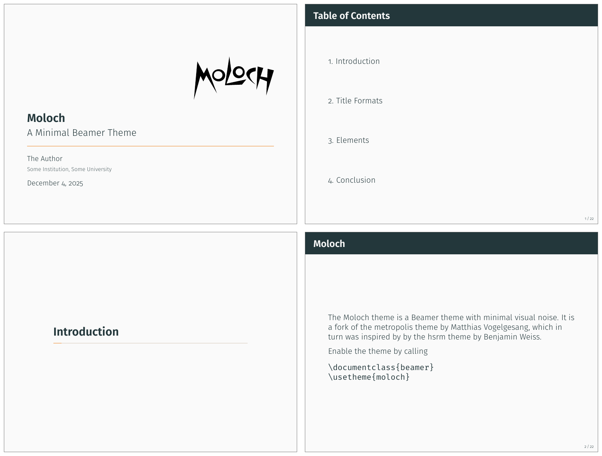

# Introduction {-}

Beamer is a great way to make presentations with LaTeX, but its theme selection
is surprisingly sparse. The stock themes share an aesthetic that can be a little
cluttered, while the few distinctive custom themes available are often
specialized for a particular corporate or institutional brand.

The goal of Moloch is to provide a simple, modern Beamer theme suitable for
anyone to use. It tries to minimize noise and maximize space for content; the
only visual flourish it offers is an (optional) progress bar added to each slide
or to the section slides.

Moloch is maintained at <https://github.com/jolars/moloch>. If you have any
issues, find mistakes in the manual or want to help make the theme even better,
please get in touch there.

Moloch is a fork of the popular Metropolis theme by Matthias Vogelgesang. The
motivation for the fork was to fix some longstanding bugs in Metropolis and also
simplify the codebase to make it easier to maintain and less fragile to changes
in the underlying Beamer code.

Here's a small demo of what Moloch looks like:

